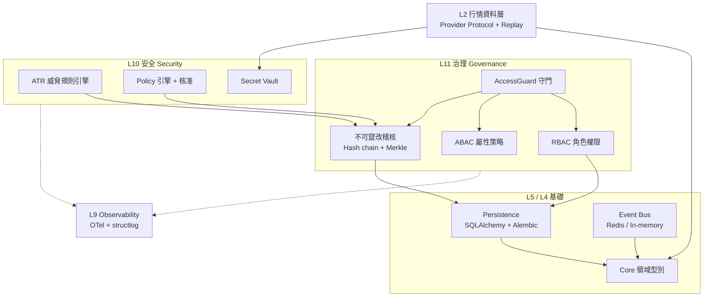

# StanCapital-TEST

> 企業級量化交易平台的「治理與安全底座」作品集展示版
> A portfolio showcase of the governance & security foundation of an agent-native quant trading platform.

[](https://github.com/StanQuant/StanCapital-TEST/actions/workflows/ci.yml)


這個 repo 是從私人開發中的量化交易平台裡，挑出**與券商、策略無關的通用核心**整理而成。重點是展示：
當交易決策可能由 AI agent 發起時，系統如何做到「**每個動作都有權限、有稽核、可追溯、預設拒絕**」。

> ⚠️ 範圍說明：本展示版**不包含**任何券商串接、交易策略、真實帳號或憑證。所有測試資料皆為虛構。

---

## 亮點

| 面向 | 內容 |
|---|---|
| **權限控管** | RBAC（角色權限矩陣）＋ ABAC（屬性式策略 DSL），預設 fail-closed |
| **不可竄改稽核** | Hash chain ＋ Merkle tree 稽核日誌、簽章與驗證器；PostgreSQL 觸發器＋低權帳號雙防線，改內容／刪記錄／動鏈頭皆可偵測 |
| **AI agent 威脅防護** | ATR（Agent Threat Rules）規則引擎：權限提升、Prompt Injection、資料外洩、繞過治理等 8 類威脅的偵測、評分與自動回應 |
| **策略引擎** | 可版本化的 Policy DSL、表達式求值、人工核准流程 |
| **密鑰管理** | Secret Vault 抽象層（記憶體／macOS Keychain／pass／Vault・雲端 Secret Manager adapter），含輪替、遮蔽、稽核 |
| **可觀測性** | OpenTelemetry 追蹤＋指標、structlog 結構化日誌、敏感資訊自動遮蔽；附 Grafana / Prometheus / Loki / Tempo 設定 |
| **資料層** | 供應商中立的行情 Provider Protocol、可重播（replay）資料源、斷線重連、法遵閘門（未經核准不得真連線） |
| **基礎設施** | SQLAlchemy async ＋ Alembic migration、Redis / in-memory 事件匯流排 |

## 工程品質

- **1,898 個測試**（含 PostgreSQL / Redis 真實整合測試），**100% 行＋分支覆蓋率閘門**
- **mypy strict** 全專案型別檢查
- **import-linter 10 條架構契約**：強制分層依賴方向（例如核心層不得 import 上層、稽核與評估器分離）
- **Mutation testing**：關鍵模組以 mutmut 驗證測試真的能抓到錯誤
- **CI**：gitleaks 密鑰掃描、ruff、mypy、import-linter、pytest、pip-audit 依賴漏洞稽核；每週排程安全掃描
- **10 份架構決策紀錄（ADR）**：見 [`docs/adr/`](docs/adr/)

## 架構



依賴方向只能由上往下；違反分層的 import 會在 CI 被 import-linter 擋下（規則見 [`.importlinter`](.importlinter)）。

## 專案結構

```
src/
├── core/            領域型別、事件、驗證
├── data/            行情 Provider Protocol、replay、重連、法遵閘門
├── governance/      RBAC、ABAC、稽核日誌、AccessGuard
├── messaging/       事件匯流排（Redis / in-memory）
├── observability/   追蹤、指標、日誌、遮蔽
├── persistence/     資料庫引擎、Repository、Unit of Work
└── security/        ATR 引擎、Policy 引擎、Secret Vault
tests/               單元＋整合＋mutation-killer 測試
infra/               PostgreSQL / Redis / 可觀測性堆疊（docker compose）
policies/            ABAC / ATR / 安全策略 YAML
docs/adr/            架構決策紀錄
```

## 本機執行

需要 [uv](https://docs.astral.sh/uv/) 與 Python 3.12。

```bash
uv sync --all-extras --dev
uv run pytest -m "not integration" --no-cov   # 單元測試，不需 docker
```

完整測試（含整合測試與 100% 覆蓋率閘門）需先啟動本機 PostgreSQL / Redis：

```bash
docker compose -f infra/db/docker-compose.yml up -d --wait
uv run pytest
```

> `infra/` 與 `.env.example` 中的密碼皆為本機開發用的佔位值，不是任何真實環境的密碼。

## 授權

© StanQuant. All rights reserved. 本 repo 僅供作品展示與閱讀，未授權任何形式的使用、修改或散布。
